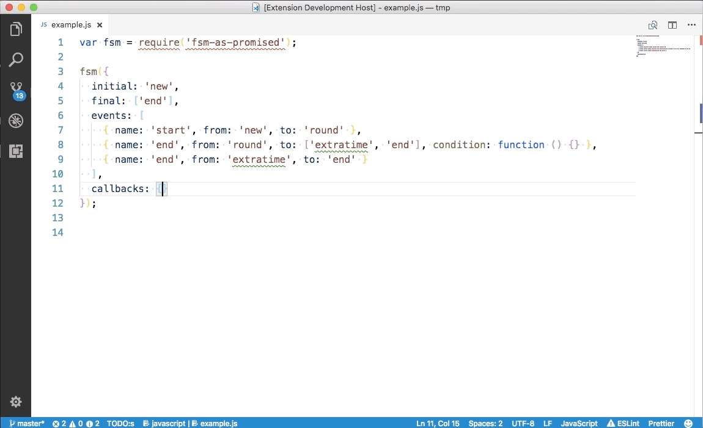

# fsm-viewer

View finite state machines using [fsm-as-promised](https://github.com/vstirbu/fsm-as-promised) library as UML diagrams in VSCode

## Features

Edit the file containing finite state machine implemented using the [fsm-as-promised](https://github.com/vstirbu/fsm-as-promised) library in the editor. Open the Command Palette and type `View FSM as UML diagram`. The extension will render the corresponding UML diagram in a new panel.

## Acknowledgements

Icons used for export functions designed by [Smashicons](https://www.flaticon.com/authors/smashicons) from Flaticon.
